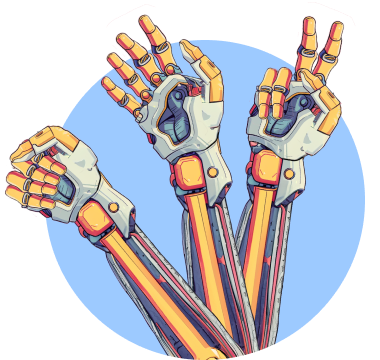
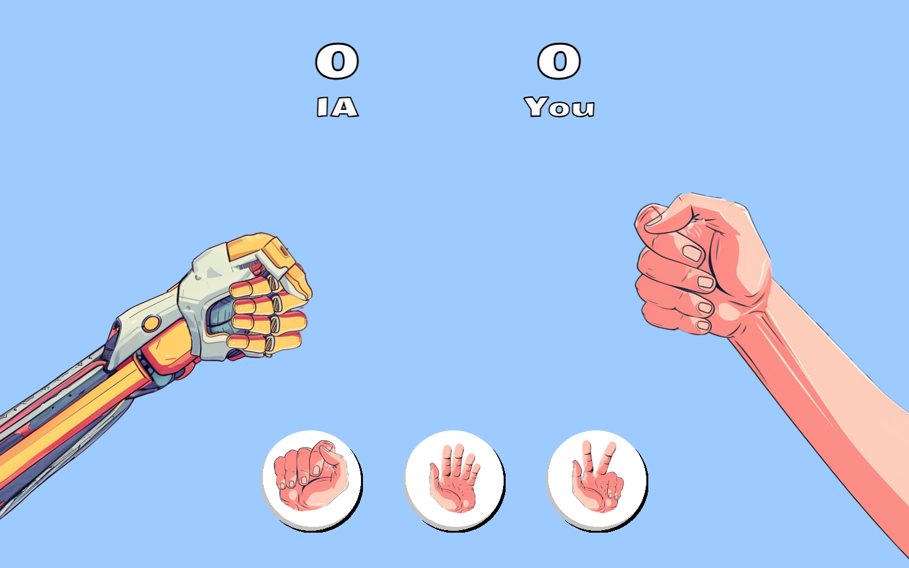
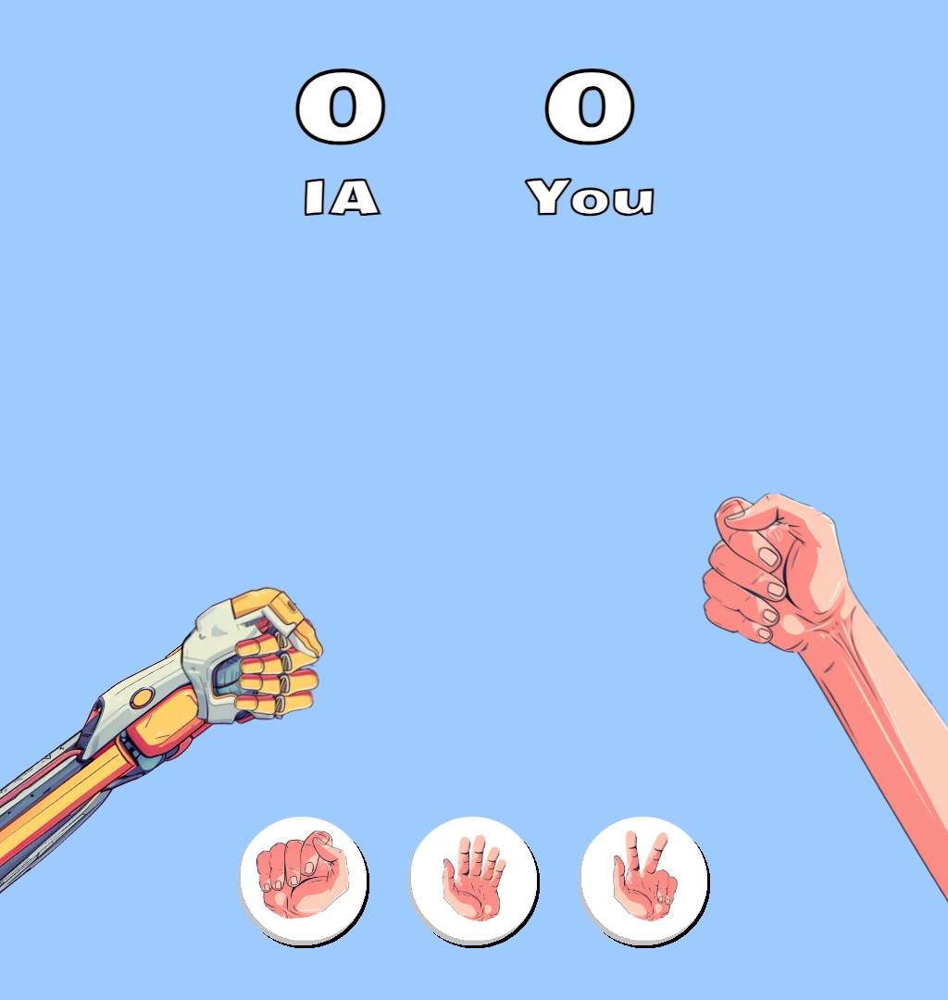
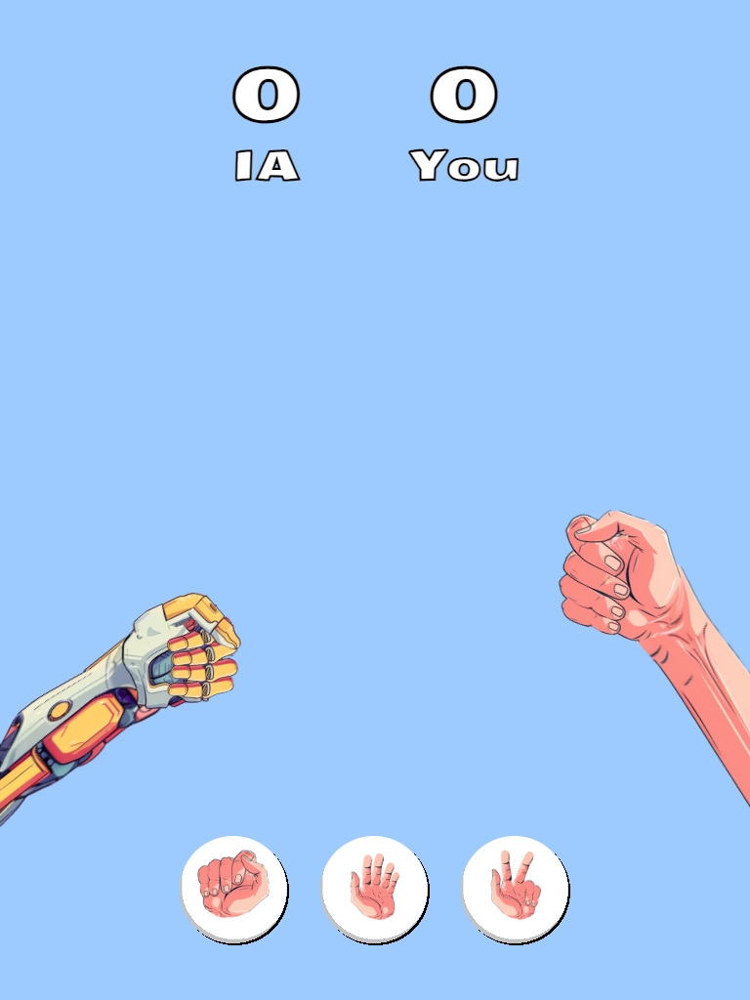
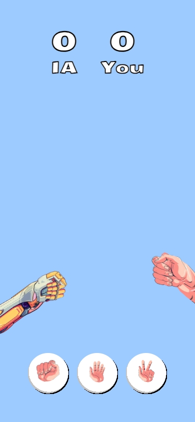

  

# Rock, Paper, Scissors game

This project is part of [The Odin Project](https://www.theodinproject.com/lessons/foundations-rock-paper-scissors) study plan.

## 📷 Screenshots

https://github.com/user-attachments/assets/ce7d3566-f003-4628-9496-e0c8c92080dc

Desktop

Laptop

Tablet

Mobile

## 🎮 Demo
-  [Live demo here!](https://osmarmora05.github.io/rock-paper-scissors/)

## 🛠️ Tech Stack
-  HTML
-  CSS
-  JavaScript
-  Git
-  Figma
## ❤️ Credits
The UI was taken and inspired from Facundo Cabanne's figma design, available at the [link](https://www.figma.com/community/file/1261148683621068639).
